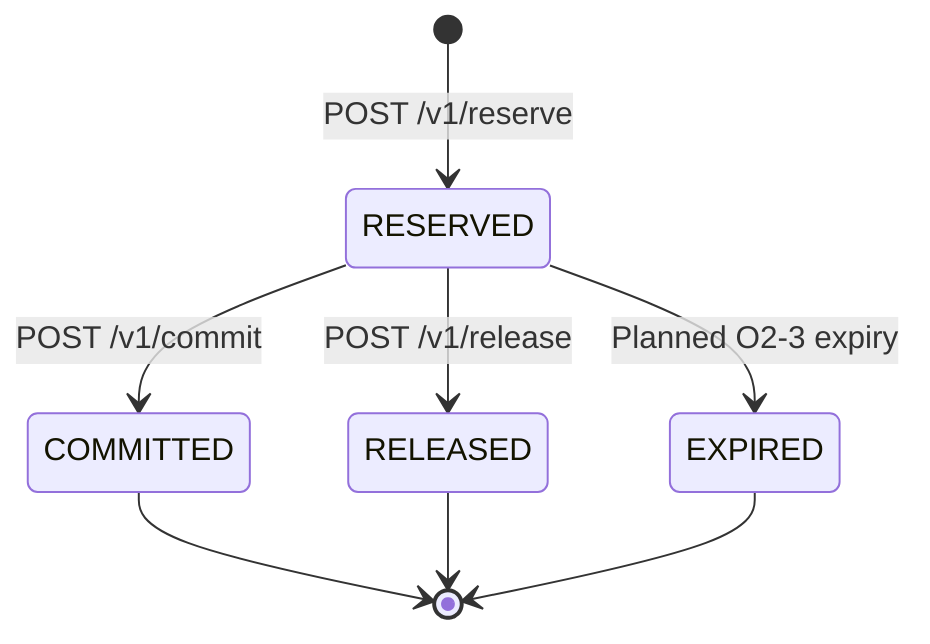

# Architecture overview

The repository implements one Spring Boot service (`service/`) backed by PostgreSQL. The service
uses `JdbcTemplate`; the domain package is kept independent of Spring and persistence libraries.
`docker-compose.yml` starts PostgreSQL 16 and the application for local use.

## Components and flow

Reserve, Commit, and Release first claim the unique operation key inside an explicit `READ COMMITTED`
transaction. `INSERT ... ON CONFLICT DO NOTHING` waits for a concurrent owner; a subsequent
statement reads its completed response or rejects a different command/body with `422`.
Replay is resolved before inspecting mutable business state.

For a new operation, `POST /v1/reserve` locks capacity and checks available units. Commit and
Release lock the reservation, then capacity: Commit moves `reserved` to `committed`, while
Release moves `reserved` back to `available` and leaves `total` and `committed` unchanged.
Business, audit, outbox, and the completed stored response commit together. The internal `PENDING` claim never commits
on its own; an exception or disconnected transaction rolls it back and frees the key for retry.
Query endpoints read persisted capacity or a stored operation response. See
[the operation-claim decision](../decisions/DEC-LEDGER-05-operation-claim.md).

The outbox is storage only: records default to `dispatched=false`, and no relay worker is
implemented. `control-plane/`, `simulation/`, and the non-PostgreSQL engine directories contain
no implemented runtime path.

## Reservation lifecycle

Only one terminal transition may commit. A competing Commit or Release waits on the reservation
row, then observes the winner's terminal state and returns `409` without another capacity,
audit, or outbox effect. A same-command replay under the winning key returns the stored body
before acquiring business locks. `EXPIRED` is accepted by the schema and rejected by Commit
and Release as terminal, but no expiry path is implemented. `expires_at = NULL` means never
expires; current Reserve requests still store NULL even when they include `ttlSec`.

## Persistent model

The schema is defined by forward-only Flyway migrations.
[`V1__init.sql`](../../service/src/main/resources/db/migration/V1__init.sql) creates:

- `account` and one `capacity` row per account;
- `reservation` and `operation` for the reservation lifecycle and idempotent replay;
- `audit_entry` for before/after snapshots; and
- `outbox` for transactional event staging.

[`V2__release_terminal_states.sql`](../../service/src/main/resources/db/migration/V2__release_terminal_states.sql)
extends reservation statuses with `RELEASED` and `EXPIRED` and documents NULL expiration semantics
without backfilling existing reservations. See [migration rollout ordering](../development/database-migrations.md).

`capacity.available` is a stored generated value: `total - reserved - committed`. Database check
constraints prevent negative capacity; row locks serialize the current implementation's capacity
updates. The detailed behavioral guarantees are in the [ledger invariants](../design/specifications/ledger-invariants.md).
