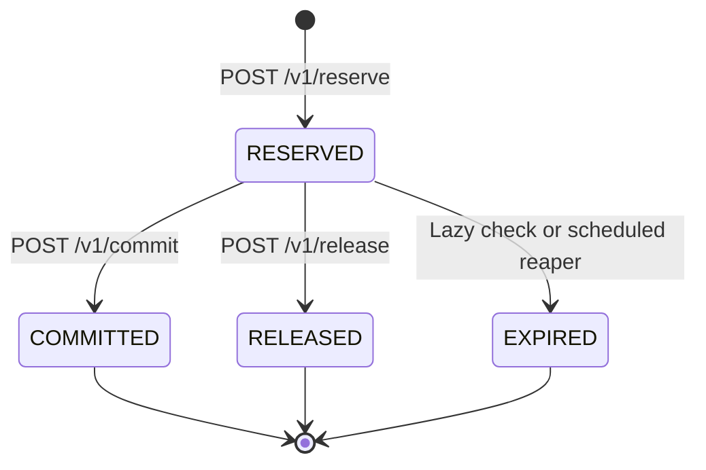

# Architecture overview

The repository implements one Spring Boot service (`service/`) backed by PostgreSQL. The service
uses `JdbcTemplate`; the domain package is kept independent of Spring and persistence libraries.
`docker-compose.yml` starts PostgreSQL 16 and the application for local use.

## Components and flow

Reserve, Commit, Release, and Transfer first claim the unique operation key inside an explicit `READ COMMITTED`
transaction. `INSERT ... ON CONFLICT DO NOTHING` waits for a concurrent owner; a subsequent
statement reads its completed response or rejects a different command/body with `422`.
Replay is resolved before inspecting mutable business state.

For a new operation, `POST /v1/reserve` locks capacity and checks available units. Commit and
Release lock the reservation, then capacity: Commit moves `reserved` to `committed`, while
Release moves `reserved` back to `available` and leaves `total` and `committed` unchanged.
Transfer locks both capacities in global order, then subtracts from source `total` and adds to
destination `total`, leaving both accounts' reservation counters unchanged.
Business, audit, outbox, and the completed stored response commit together. The internal `PENDING` claim never commits
on its own; an exception or disconnected transaction rolls it back and frees the key for retry.
Capacity queries first expire due reservations for the addressed account in individual transactions;
operation lookups only read the immutable stored response. See
[the operation-claim decision](../decisions/DEC-LEDGER-05-operation-claim.md).

The outbox is storage only: records default to `dispatched=false`, and no relay worker is
implemented. `control-plane/`, `simulation/`, and the non-PostgreSQL engine directories contain
no implemented runtime path.

## Lock order

The hierarchy is operation claim → existing reservation, when applicable → capacity rows.
Transfer skips the reservation tier and acquires both capacities with one bound query:

```sql
SELECT account_id, total, reserved, committed, available, version
FROM capacity WHERE account_id IN (?, ?)
ORDER BY account_id ASC FOR UPDATE;
```

PostgreSQL orders UUIDs consistently regardless of source/destination direction. Both opposing
requests lock the lower UUID before the higher UUID, preventing a circular capacity-lock wait.
The immutable account IDs keep this order stable while a `READ COMMITTED` waiter rereads an
updated row. Do not substitute Java's signed `UUID.compareTo` order for PostgreSQL's UUID order.
Single-account operations acquire no second capacity lock and cannot close that cycle.
Transfer neither locks existing reservations nor claims another operation after taking capacity
locks. This extends [DEC-LEDGER-06](../decisions/DEC-LEDGER-06-lock-order-expiry-clock.md).

Balance and overflow checks run under both locks, before debit and credit. The updates, a single
audit with both accounts' before/after snapshots, one outbox event, and the completed operation
share the transaction. A connection loss after debit rolls back the claim and all writes. A
response lost after commit is resolved by operation lookup or a byte-identical same-key replay.
These are single-principal guarantees; global keys do not provide tenant isolation.

## Reservation lifecycle



Only one terminal transition may commit. A competing Commit or Release waits on the reservation
row, then observes the winner's terminal state and returns `409` without another capacity,
audit, or outbox effect. A same-command replay under the winning key returns the stored body
before acquiring business locks. Commit and Release check deadlines after locking the reservation,
using the PostgreSQL transaction-start timestamp (`now()`). A due reservation causes the user
transaction to roll back; a separate internal expiry transaction completes before returning `409`.
This preserves operation-claim-first ordering and prevents the rejected command from rolling
back expiry or retaining the client's key.

Reserve stores `expires_at = now() + ttlSec` seconds when a TTL is supplied; otherwise NULL means
never expires. Replays neither renew the deadline nor rewrite the original response. The clock
is constant throughout each transaction, including time spent waiting for locks.

The single-node reaper runs with fixed delay and a candidate batch cap. Its candidate scan takes
no reservation locks. For each candidate, an independent `READ COMMITTED` transaction claims an
internal operation, locks the reservation with `FOR UPDATE SKIP LOCKED`, rechecks deadline/state,
then locks capacity. Expiry sets `EXPIRED`, releases reserved capacity, inserts one `EXPIRE` audit
and one outbox event with status `EXPIRED`, and completes its operation atomically. Skips/no-ops
roll back the claim; failures roll back all effects. A short per-item background lock timeout
bounds capacity-lock waits. Lazy expiry uses the same transition with a waiting reservation lock.
See [configuration](../reference/configuration.md) and the [runbook](../operations/runbooks/o2-expiry-reaper.md).

## Persistent model

The schema is defined by forward-only Flyway migrations.
[`V1__init.sql`](../../service/src/main/resources/db/migration/V1__init.sql) creates:

- `account` and one `capacity` row per account;
- `reservation` and `operation` for the reservation lifecycle and idempotent replay;
- `audit_entry` for before/after snapshots; and
- `outbox` for transactional event staging.

[`V2__release_terminal_states.sql`](../../service/src/main/resources/db/migration/V2__release_terminal_states.sql)
extends reservation statuses with `RELEASED` and `EXPIRED` and documents NULL expiration semantics
without backfilling existing reservations. See [migration rollout ordering](../development/database-migrations.md).
Transfer reuses the V1/V2 schema: `INT` bounds, nonnegative capacity checks, and the existing
operation, audit, and outbox tables already support it.

[`V3__reservation_expiry.sql`](../../service/src/main/resources/db/migration/V3__reservation_expiry.sql)
adds a partial due-reservation index and updates the expiration column comment. It does not
backfill deadlines or change existing reservations; no migration is rewritten.

`capacity.available` is a stored generated value: `total - reserved - committed`. Database check
constraints prevent negative capacity; row locks serialize the current implementation's capacity
updates. The detailed behavioral guarantees are in the [ledger invariants](../design/specifications/ledger-invariants.md).
