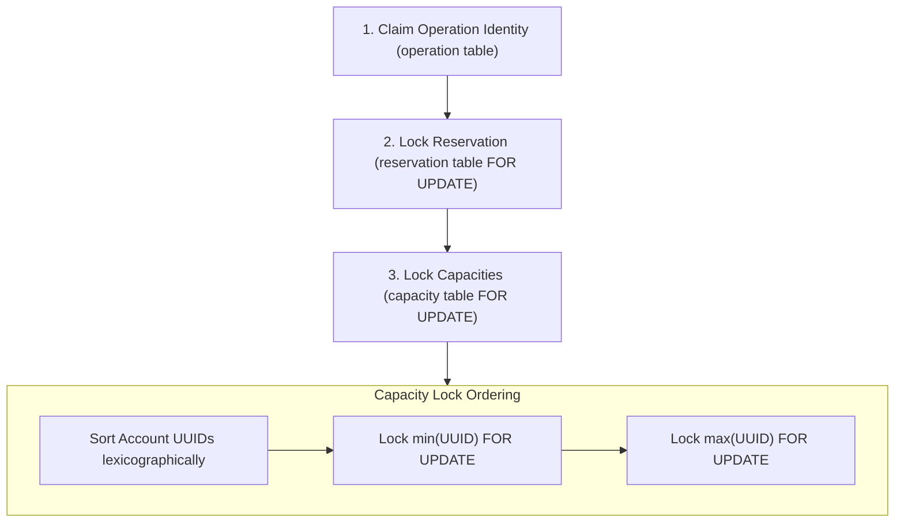
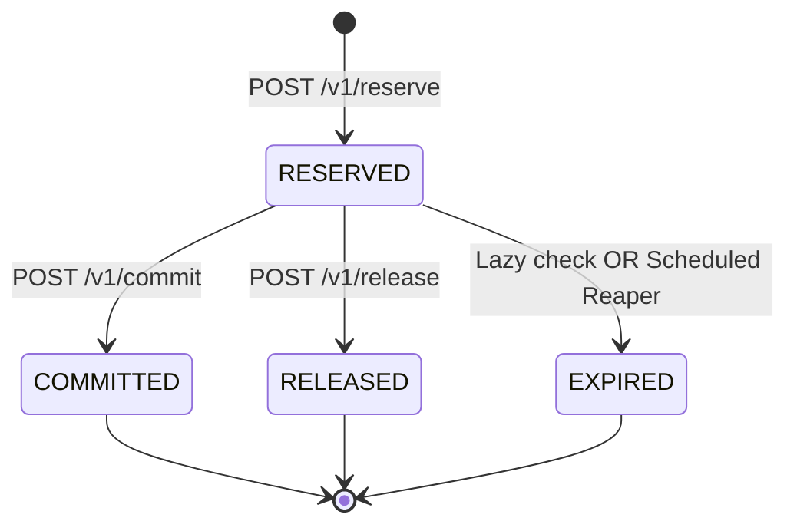

# RFC: O2 — Transfer Accounting, Lock Ordering, and Expiry Semantics

- **Status**: Accepted (Design baseline for Milestone O2: `O2-1`, `O2-2`, `O2-3`, `O2-4`)
- **Date**: 2026-09-13
- **Author**: Ledger Engineering Team
- **Parent Outcome**: [O2 — Release & Transfer are race-free at capacity edge](https://app.notion.com/p/O2-Release-Transfer-are-race-free-at-capacity-edge-3d60a821b3cc81adb31ac9d6941aab71)
- **Approved Plan**: [Plan O2](https://app.notion.com/p/3d90a821b3cc81b4a5a4f62fa6dd30a3)
- **Decisions**: [DEC-LEDGER-03](../../decisions/DEC-LEDGER-03-schema.md), [DEC-LEDGER-04](../../decisions/DEC-LEDGER-04-concurrency.md), [DEC-LEDGER-05](../../decisions/DEC-LEDGER-05-operation-claim.md), [DEC-LEDGER-06](../../decisions/DEC-LEDGER-06-lock-order-expiry-clock.md)
- **Risks**: [RISK-LEDGER-01 (Concurrency Anomaly)](https://app.notion.com/p/3d60a821b3cc81adb31ac9d6941aab71)

---

## 1. Summary and Purpose

In Milestone O1, the ledger established single-account capacity reservations and commits (`Reserve → Commit → Query`) with operation-first idempotency claims and crash recovery.

Milestone O2 expands the capability to:
1. **Release**: Freeing an active reservation back to available capacity.
2. **Transfer**: Moving capacity atomically between two accounts in a single local transaction without partial states or deadlocks.
3. **Expiry**: Expiring reservations past their time-to-live (`ttlSec`) via lazy checks and a scheduled reaper.

This RFC defines the mathematical accounting formulas, deterministic multi-row lock ordering, terminal state transition matrix, authoritative expiration clock rules, and migration semantics required before implementing slices `O2-1` through `O2-4`.

---

## 2. Transfer Accounting & Invariants

### 2.1 Equations

A transfer moves unreserved/uncommitted capacity amount $A$ ($A \in \mathbb{Z}^+, A > 0$) from a source account $S$ (`fromAccountId`) to a destination account $D$ (`toAccountId`) in a single database transaction.

For any account $X$:
$$\text{available}_X = \text{total}_X - \text{reserved}_X - \text{committed}_X$$

#### Pre-conditions:
1. $S \ne D$ (self-transfer is rejected with HTTP `400 Bad Request`).
2. Both accounts $S$ and $D$ exist in `account` and `capacity` tables.
3. Amount is valid: $0 < A \le \text{INT\_MAX}$ ($2,147,483,647$).
4. Source balance sufficiency: $\text{available}_S \ge A$.
5. Destination capacity overflow limit: $\text{total}_D + A \le \text{INT\_MAX}$.

#### Mutation:
$$\text{total}_S \leftarrow \text{total}_S - A$$
$$\text{total}_D \leftarrow \text{total}_D + A$$
$$\text{reserved}_S, \text{committed}_S, \text{reserved}_D, \text{committed}_D \quad \text{remain unchanged}$$

#### Invariants:
1. **Capacity Nonnegativity**: $\text{available}_S \ge 0$, $\text{available}_D \ge 0$, $\text{total}_S \ge 0$, $\text{total}_D \ge 0$.
2. **Global Conservation**: $\Delta \text{total}_S + \Delta \text{total}_D = (-A) + (+A) = 0$.
   Across all accounts in the system, $\sum_{i} \text{total}_i$ is strictly conserved.
3. **Atomicity**: The source debit and destination credit occur in the exact same database transaction alongside the operation claim, audit entry (`kind='TRANSFER'`), and outbox entry (`aggregate='transfer'`, following the implemented lowercase aggregate convention). No intermediate or half-transferred state is ever visible or committed.

---

### 2.2 Worked Examples

#### Example 1: Standard Transfer ($A \to B$)
- Initial state:
  - Account A: $\text{total}=1000, \text{reserved}=200, \text{committed}=100 \implies \text{available}=700$
  - Account B: $\text{total}=500, \text{reserved}=50, \text{committed}=50 \implies \text{available}=400$
- Operation: Transfer amount $A=300$ from Account A to Account B.
- Verification:
  - $\text{available}_A = 700 \ge 300$ (sufficient).
  - $\text{total}_B + 300 = 800 \le \text{INT\_MAX}$ (no overflow).
- Final state:
  - Account A: $\text{total}=700, \text{reserved}=200, \text{committed}=100 \implies \text{available}=400$
  - Account B: $\text{total}=800, \text{reserved}=50, \text{committed}=50 \implies \text{available}=700$
- System total balance change: $\Delta \text{total}_A + \Delta \text{total}_B = -300 + 300 = 0$ (conserved).

#### Example 2: Opposite-Direction Concurrent Transfers ($A \to B$ and $B \to A$)
- Initial state:
  - Account A: $\text{total}=1000, \text{reserved}=0, \text{committed}=0 \implies \text{available}=1000$ (UUID: `11111111-1111-4111-8111-111111111111`)
  - Account B: $\text{total}=1000, \text{reserved}=0, \text{committed}=0 \implies \text{available}=1000$ (UUID: `22222222-2222-4222-8222-222222222222`)
- Concurrency:
  - Tx1 attempts $T_{1}: A \to B$ ($A=200$).
  - Tx2 attempts $T_{2}: B \to A$ ($A=100$).
- Lock Order Resolution:
  - Both Tx1 and Tx2 sort account IDs: $\min(A, B) = A$, $\max(A, B) = B$.
  - Both transactions attempt to lock row $A$ first, then row $B$.
  - Winner (say Tx1) acquires lock on $A$, then acquires lock on $B$. Tx2 waits on lock $A$.
  - Tx1 executes: $\text{total}_A = 800, \text{total}_B = 1200$, commits, and releases locks.
  - Tx2 acquires lock on $A$, then lock on $B$. In `READ COMMITTED`, Tx2 reads updated rows: $\text{available}_B = 1200 \ge 100$.
  - Tx2 executes: $\text{total}_B = 1100, \text{total}_A = 900$, commits, and releases locks.
- Final state:
  - Account A: $\text{total}=900, \text{available}=900$
  - Account B: $\text{total}=1100, \text{available}=1100$
- Result: **Zero deadlocks, zero lock timeouts, zero lost updates, system total = 2000 conserved**.

#### Example 3: Same-Account Transfer ($A \to A$)
- Request: `POST /v1/transfer {"fromAccountId": "A", "toAccountId": "A", "amount": 100, "idempotencyKey": "..."}`
- Policy: **Explicit validation rejection (`400 Bad Request`)**.
- Rationale: Self-transfers do not alter capacity, create redundant audit entries, and introduce self-lock / double-lock edge cases. Rejection occurs prior to acquiring locks or database mutations.

---

## 3. Global Lock Order Hierarchy

To guarantee deadlock-freedom across all concurrent single-account and multi-account operations under PostgreSQL `READ COMMITTED`, every transaction must acquire locks in a strict global hierarchy.



### Hierarchy Rules:
1. **Tier 1 — Operation Claim**:
   - `INSERT INTO operation (id, idempotency_key, type, status, request_hash) VALUES (...) ON CONFLICT (idempotency_key) DO NOTHING;`
   - If conflict detected, read winner in `READ COMMITTED` and evaluate replay / mismatch.
2. **Tier 2 — Reservation Row**:
   - For operations targeting an existing reservation (`Commit`, `Release`, `Expire`):
   - `SELECT * FROM reservation WHERE id = :reservationId FOR UPDATE;`
3. **Tier 3 — Capacity Row(s)**:
   - For single-account mutations (`Reserve`, `Commit`, `Release`, `Expire`):
     - `SELECT * FROM capacity WHERE account_id = :accountId FOR UPDATE;`
   - For multi-account mutations (`Transfer`):
     - Compute sorted order: $U_1 = \min(\text{fromAccountId}, \text{toAccountId})$ and $U_2 = \max(\text{fromAccountId}, \text{toAccountId})$.
     - Execute single statement with deterministic row lock order:
       ```sql
       SELECT * FROM capacity 
       WHERE account_id IN (:fromAccountId, :toAccountId) 
       ORDER BY account_id ASC 
       FOR UPDATE;
       ```

---

## 4. Terminal State Matrix and Race Resolution

A reservation lifecycle progresses from `RESERVED` to exactly one irreversible terminal state: `COMMITTED`, `RELEASED`, or `EXPIRED`.



### 4.1 Transition Matrix

| Current State | Command / Event | Next State | HTTP Status | Capacity Effect | Audit Effect | Outbox Effect |
| :--- | :--- | :--- | :--- | :--- | :--- | :--- |
| `RESERVED` | `Commit` | `COMMITTED` | `200 OK` | `reserved -= A, committed += A` | Insert `COMMIT` | Insert `COMMITTED` |
| `RESERVED` | `Release` | `RELEASED` | `200 OK` | `reserved -= A` (`available += A`) | Insert `RELEASE` | Insert `RELEASED` |
| `RESERVED` | `Expire` (TTL reached) | `EXPIRED` | N/A (Internal) | `reserved -= A` (`available += A`) | Insert `EXPIRE` | Insert `EXPIRED` |
| `COMMITTED` | `Commit` (same key + hash) | `COMMITTED` | `200 OK` | None (Replay response) | None | None |
| `COMMITTED` | `Commit` (diff key) | `COMMITTED` | `409 Conflict` | None | None | None |
| `COMMITTED` | `Release` / `Expire` | `COMMITTED` | `409 Conflict` / Internal no-op | None | None | None |
| `RELEASED` | `Release` (same key + hash) | `RELEASED` | `200 OK` | None (Replay response) | None | None |
| `RELEASED` | `Release` (diff key) | `RELEASED` | `409 Conflict` | None | None | None |
| `RELEASED` | `Commit` / `Expire` | `RELEASED` | `409 Conflict` / Internal no-op | None | None | None |
| `EXPIRED` | `Commit` / `Release` | `EXPIRED` | `409 Conflict` | None | None | None |
| Any | Any (same key, diff hash) | Unchanged | `422 Unprocessable` | None | None | None |

### 4.2 Terminal Race Rules:
- **Winner Determination**: A transaction holding the reservation lock must observe `RESERVED` and satisfy its deadline check before applying a terminal transition, capacity adjustments, and audit/outbox entries. Commit/Release evaluate the deadline against their transaction-start timestamp; Expire requires the deadline to be due in its own transaction.
- **Loser Behavior**: A competing Commit/Release rereads the terminal state after acquiring the lock and returns `409` without modifying capacity or creating audit rows. A background Expire skips locked reservations and rolls back its internal claim when the candidate is no longer due or active.

---

## 5. Expiry Semantics and Clock Authority

### 5.1 Authoritative Clock Selection
- **Decision**: PostgreSQL transaction timestamp (`now()` / `transaction_timestamp()`) is the sole authoritative clock for expiration.
- **Rationale**: Application host clocks drift across multi-instance deployments and container environments. PostgreSQL supplies one timestamp fixed at transaction start, including time spent waiting for locks. It does not advance within that transaction.
- **Deadline storage**: A new Reserve stores `now() + ttlSec` seconds when a TTL is supplied; a replay leaves the original deadline unchanged.

### 5.2 Expiry Evaluation Paths
1. **Lazy Expiry on Access**:
   - Commit and Release resolve replay/mismatch first, then lock and check the reservation. A due `RESERVED` row causes the command transaction to roll back its claim. An independent expiry transaction claims its own operation, locks and rechecks the row, and commits expiry before the command returns `409 Conflict`. A concurrent terminal winner remains unchanged.
   - Account capacity queries expire due reservations for that account individually before reading counters. Operation-response lookup does not trigger expiry. Stored responses are never rewritten.
2. **Scheduled Expiry Reaper**:
   - A single-node fixed-delay worker discovers a bounded candidate batch without taking row locks:
     ```sql
     SELECT id FROM reservation 
     WHERE status = 'RESERVED' 
       AND expires_at IS NOT NULL 
       AND expires_at <= now()
     ORDER BY expires_at ASC, id ASC
     LIMIT :batchSize;
     ```
   - Each candidate uses a separate short transaction: claim an internal operation, then acquire the reservation with `FOR UPDATE SKIP LOCKED` and recheck its state/deadline, then lock capacity.
   - A due `RESERVED` row transitions to `EXPIRED`, decrements `reserved`, and inserts exactly one `audit_entry(kind='EXPIRE')` and `outbox(aggregate='reservation')` with payload status `EXPIRED`. The completed internal operation commits in the same transaction.
   - Skipped or stale candidates roll back their operation claim. `SKIP LOCKED` avoids waiting on active reservation locks; a per-item background `lock_timeout` bounds waits on capacity. Repeated sweeps cannot create a second terminal effect. Lazy expiry uses a waiting reservation lock.

### 5.3 Semantics of `NULL expires_at`
- **Rule**: `expires_at IS NULL` signifies **Never Expires**.
- **Migration & Backward Compatibility**: All reservations created during O1 have `expires_at = NULL`. They remain valid until explicitly committed or released. No schema backfill is required.

---

## 6. Overflow and Data Boundary Specifications

1. **Storage Types**:
   - All monetary/capacity quantities are 32-bit signed integers (`INT` / `INTEGER`), bounded by $0 \le \text{amount} \le \text{INT\_MAX} = 2,147,483,647$.
2. **Double-Guard Invariant Protection**:
   - Application-layer checks (`total > Integer.MAX_VALUE - amount`, rejecting overflow with HTTP `400` before either write).
   - Database constraint checks (`CHECK (total >= 0)`, `CHECK (reserved >= 0)`, `CHECK (committed >= 0)`, `CHECK (available >= 0)`).
3. **Identifier Constraints**:
   - All IDs (`accountId`, `reservationId`, `operationId`) are UUIDv4 strings.
   - `Idempotency-Key` length: $1..64$ printable ASCII characters.
